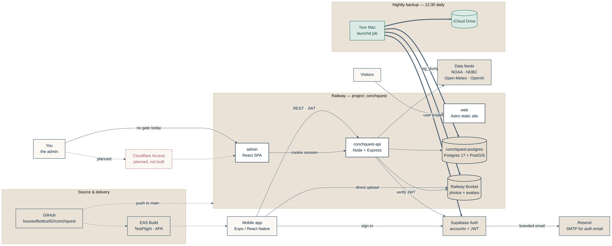

# Conchquest architecture

How the pieces fit together: five services on Railway, five outside
dependencies, and one laptop holding the only backups.

Read off the live system on 2026-08-17 -- the Railway service list, the three
`railway.json` deploy configs, the bucket contents, and the Supabase user list.
**Update this when the Cloudflare gate lands (#86).**

Line style carries meaning: solid is a runtime request, dotted is build and
deploy, thick is the nightly backup pull, dashed red is planned but not built.

`architecture.png` and `architecture.svg` in this folder are exports of the
diagram below, for slides, chat, or anywhere that won't render mermaid. The
fence is the source; **the images do not update themselves**. After changing
it, regenerate them so they don't quietly disagree with the code:

(First run on a new machine downloads a headless Chrome to
`~/.cache/puppeteer`, roughly 200 MB -- mermaid-cli renders through a real
browser. It looks like a hang; it isn't.)

```bash
npx -y @mermaid-js/mermaid-cli@11 -i <(sed -n '/```mermaid/,/```/p' docs/ARCHITECTURE.md | sed '1d;$d') -o docs/architecture.png -b '#F2ECE4' -w 2400 -s 2
```



## Inside Railway

| Service | What it is | Reached at |
| --- | --- | --- |
| `conchquest-api` | Node + Express. The only thing that talks to the database. | `api.conchquest.app` |
| `web` | Astro static site -- marketing, privacy, terms, community guidelines. | `www.conchquest.app` |
| `admin` | React SPA for moderation. Authenticates by httpOnly cookie, not JWT. | `admin.conchquest.app` |
| `conchquest-postgres` | Postgres 17 + PostGIS. Finds, beaches, species, reports, blocks. | Private network only |
| Railway Bucket | S3-compatible. Find photos and avatars, uploaded straight from the phone. | Presigned URLs |

Note the one path that bypasses the API: the mobile app uploads photos
**directly** to the bucket using a presigned URL from `api/src/services/storage.ts`.

## Outside Railway

| Service | Its job | What breaks without it |
| --- | --- | --- |
| Supabase Auth | Accounts, JWTs, password reset. Users live here, *not* in Postgres. | Nobody can sign in; finds lose their owner |
| Resend | SMTP behind Supabase's branded confirm/reset emails (#92). | Signup confirmation and password reset stall |
| Data feeds | NOAA tides, NDBC + Open-Meteo marine, OpenAI for the strategy card. | Scores degrade; the app still runs |
| GitHub | Source of truth. Pushing `main` auto-deploys Railway. | No deploys |
| EAS Build | Compiles the mobile app to TestFlight and Android. | No new app builds |

## The backup path

One `launchd` job (`app.conchquest.backup-db`) at 12:30 daily pulls all three
pieces into iCloud. It only runs when Mark's Mac is on -- that is the whole
safety net, because Railway's scheduled backups need the Pro plan and
Supabase's free plan backs up nothing at all. See `docs/TODO.md` #101.

- **Database** -- `scripts/backup-db.sh`: `pg_dump` over an SSH tunnel, and the
  archive is checked for `shell_finds` before it counts as a success. Last 14 kept.
- **Photos** -- `api/scripts/backup-photos.mjs`: every bucket object, additive
  only. It never deletes locally, so an accidental delete in the app can't
  propagate into the backup and destroy the last copy.
- **Accounts** -- `api/scripts/backup-auth.mjs`: the Supabase user list as JSON,
  so restored finds can be reattached to their real owners.

## Two gaps this diagram is honest about

**Cloudflare Access isn't built.** `admin.conchquest.app` is publicly reachable
right now, held only by the cookie login and an admin-role check. DNS still sits
at GoDaddy, and moving it is step one. Tracked as #86.

**Password hashes aren't backed up.** Supabase's Admin API doesn't expose them.
A restore recreates accounts at their original UUIDs -- so finds reattach
correctly -- but everyone resets their password once. Closing that needs a
`pg_dump` of Supabase's own `auth` schema. `api/.env` is also unbacked; it
exists only on Mark's Mac.
